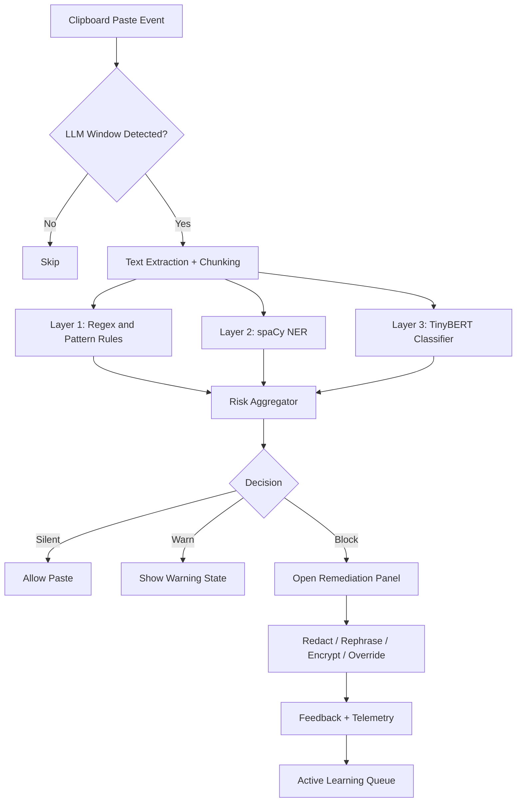
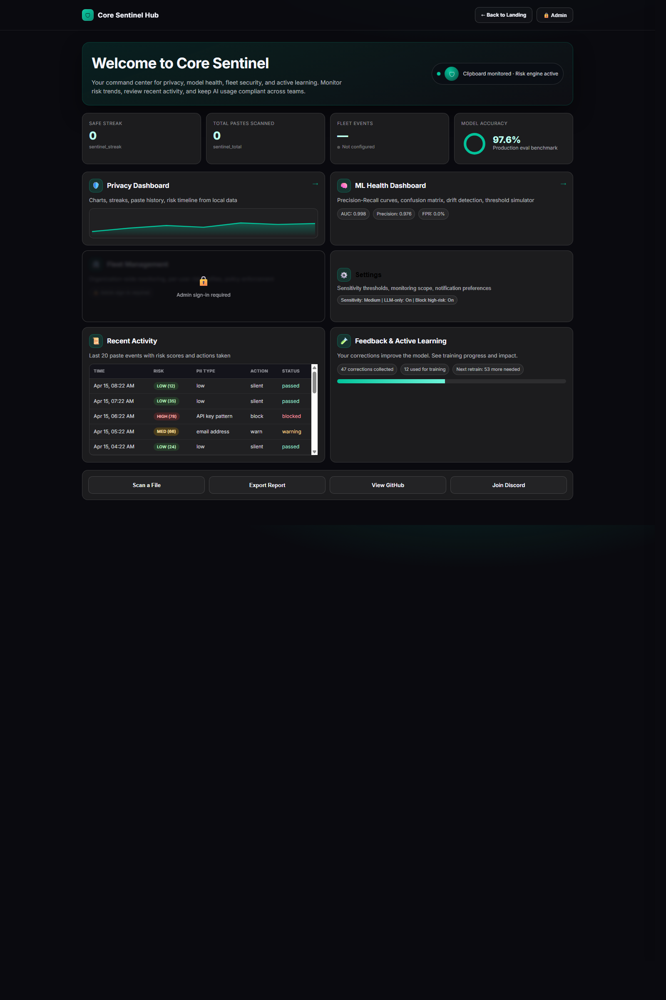
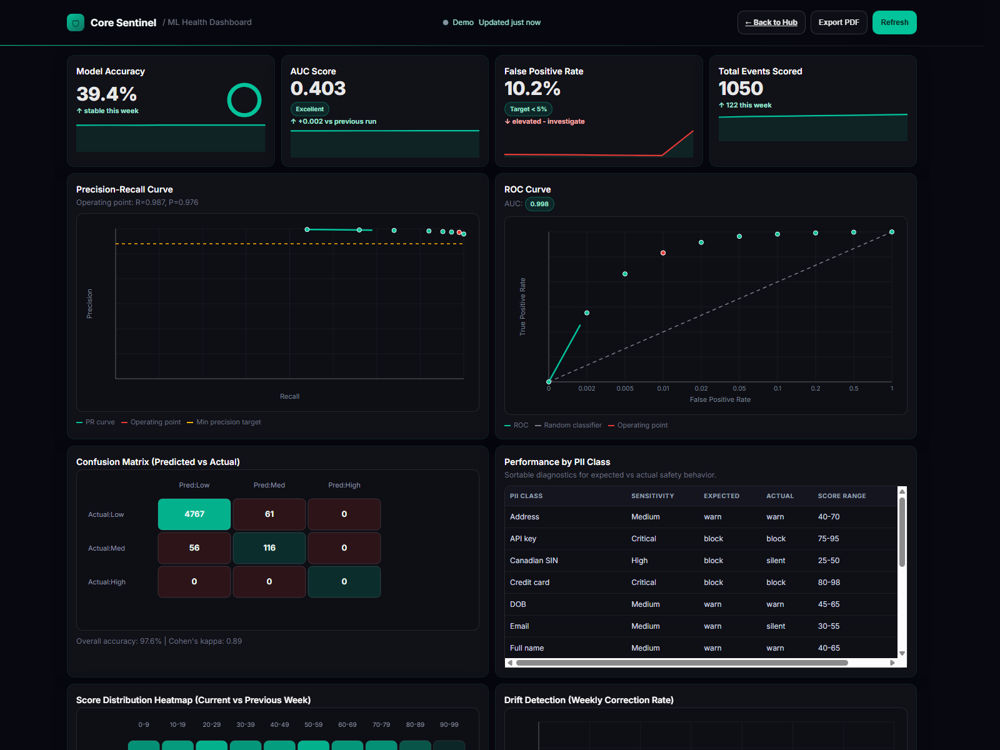
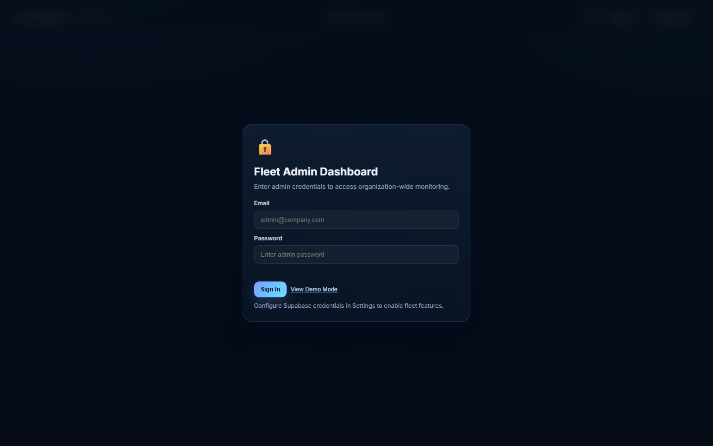
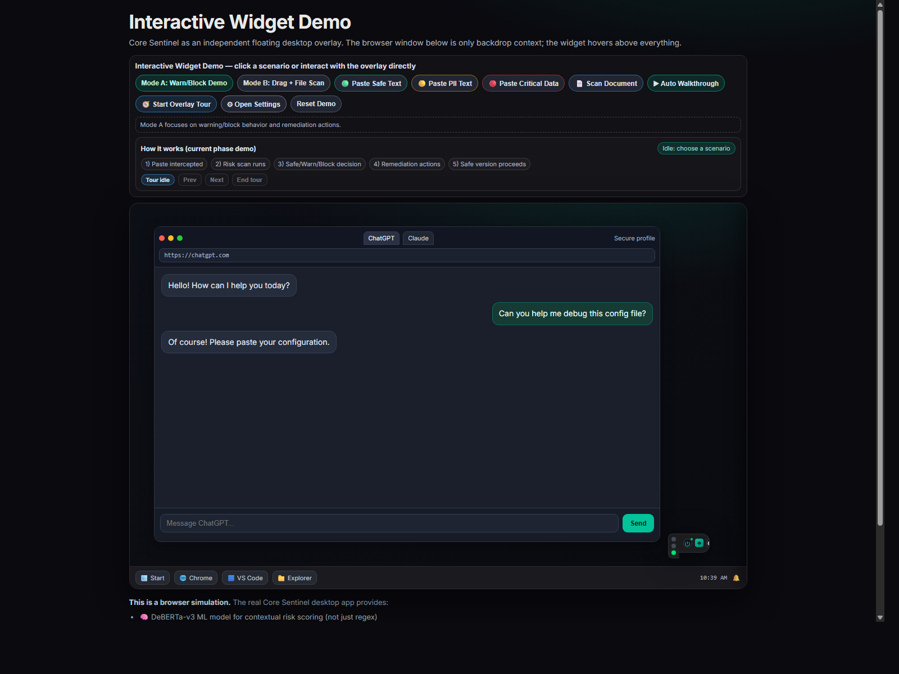

# Core Sentinel - AI Clipboard Guardian

[](LICENSE)
[](https://www.python.org/)
[](docs/WINDOWS_SETUP.md)
[](core-sentinel-guardrail/train.py)
[](core-sentinel-guardrail/main.py)

Core Sentinel is a desktop-first, privacy-focused guardrail that intercepts clipboard pastes into LLM chat windows (ChatGPT, Claude, Gemini, Copilot, and others), detects sensitive content, scores risk, and offers one-click remediation.

> **Platform support:** Windows 10/11 is supported today. Linux and iOS support are planned for future releases.

## Why Core Sentinel

- Prevent accidental leakage of PII, secrets, and regulated data into AI tools.
- Run locally by default; clipboard content stays on your machine unless you opt into sync.
- Combine deterministic pattern matching with ML-based contextual risk scoring.
- Improve over time with feedback-driven active learning.

## Table of Contents

- [Architecture](#architecture)
- [ML Architecture](#ml-architecture)
- [Start Here (New Users)](#start-here-new-users)
- [Model Card](#model-card)
- [Dashboards](#dashboards)
- [Website data and Supabase](#website-data-and-supabase)
- [Interactive Widget Demo](#-interactive-widget-demo)
- [Quick Start](#quick-start)
- [Project Structure](#project-structure)
- [Training and Evaluation](#training-and-evaluation)
- [Contributing](#contributing)
- [Security and Privacy](#security-and-privacy)
- [License](#license)

## Architecture



### Runtime Pipeline (high level)

1. Detect paste event in supported LLM window context.
2. Normalize and chunk text for model-safe inference.
3. Run regex and structured matchers for high-confidence patterns.
4. Run NER to recover contextual entities.
5. Run classifier to capture semantic leakage risk.
6. Aggregate into final 0-100 risk score.
7. Route to silent, warn, or block.
8. Capture optional correction feedback for retraining.

## ML Architecture

For a detailed technical analysis of the machine learning architecture, the three-layer detection pipeline, threshold calibration, metrics, dataset composition, HIPAA coverage, and comparative trade-offs, see **[ML Architecture Analysis](core-sentinel-guardrail/docs/ML_ANALYSIS.md)**.

## Start Here (New Users)

If you're new to Core Sentinel, use this order:

1. Launch the **interactive demo**: [▶ Demo](https://alwinphilip0105.github.io/Core_Sentinal/demo/)
2. Open the **website guided walkthrough**: [Landing page](https://alwinphilip0105.github.io/Core_Sentinal/)
3. Explore dashboards from the **hub**: [Dashboard hub](https://alwinphilip0105.github.io/Core_Sentinal/hub.html) (custom domain: [hub](https://alwinphilip.online/Core_Sentinal/hub.html))
4. For local setup, continue to [Quick Start](#quick-start).

> **Current platform:** Windows 10/11 only. Linux and iOS support are planned in future releases.

## Model Card

| Field | Value |
|---|---|
| Base architecture | `huawei-noah/TinyBERT_General_4L_312D` |
| Parameters | ~14M |
| Input strategy | Sliding windows (tokenized chunks) |
| Labeling modes | 3-class and policy-driven 9-class support |
| Training data | Synthetic PII corpus plus curated task data |
| Privacy policy | No real user clipboard data required for base training |
| Deployment target | Local desktop inference |

### Metrics and benchmarks

Numbers change with each train/eval run. After `python evaluate_test.py`, open:

- `core-sentinel-guardrail/reports/train_eval_summary.json` — validation **best** checkpoint (macro-F1, per-class recall).
- `core-sentinel-guardrail/reports/pr_curve_summary.json` — test PR/AUPRC plus **`safety_profile`** (counts where true **high** is predicted as **low** vs **med**, and benign rows flagged as high).

**Product priority:** a guardrail should not optimize headline accuracy at the expense of letting **high/critical** content look “safe” while **low-risk** text is over-penalized. Evaluation and threshold calibration treat **high recall** and **missed-high-as-low** errors as first-class; macro-F1 remains a summary, not the sole objective.

**Published site metrics:** the GitHub Pages bundle includes `docs/data/model_records.json` (binary holdout + calibration snapshots used by the ML Health page). Headline numbers are **not** interchangeable with validation-only sweeps—read `metric_notes` in that file for FPR vs FNR definitions at the chosen threshold.

## Dashboards

Core Sentinel ships with multiple dashboards for users, operators, and admins. Static HTML under **`docs/`** is what GitHub Pages serves (`/` on Pages maps to the `docs` folder on `main`).

### Privacy Dashboard

- Risk timeline and score trends
- Streak tracking
- Recent event history
- Live Supabase mode retries several `guardrail_events` query shapes so minor schema drift does not break the page



### ML Health Dashboard

- Precision/Recall views
- Confusion matrix
- Drift and threshold simulation
- Loads **`docs/data/model_records.json`** from the same origin when possible, with an embedded JSON fallback if fetches fail (hard refresh after deploy if you see stale zeros)



### Admin Dashboard

- Organization-level monitoring
- Alert and policy controls
- Risk category rollups



## Website data and Supabase

| Asset | Role |
|--------|------|
| `docs/data/model_records.json` | ML Health KPIs, PR/ROC summaries, calibration snippets—regenerate or sync from training outputs when you publish a new model. |
| `docs/data/train_eval_summary.json` | Hub “model KPI” card seed (macro-style `best` block); retrain / `model_records` data overrides when available. |
| `docs/ml/risk_policy.json` | Optional policy snapshot for the ML page. |

**Supabase REST must match your tables.** Apply the SQL under `core-sentinel-guardrail/supabase/` (e.g. `guardrail_events.sql`, `feedback_corrections.sql`, `retrain_runs.sql`, `document_scans.sql` for local file scan telemetry). The stock `guardrail_events` table exposes fields such as `timestamp`, `text_hash`, `action`, `risk_score`, `pii_classes`, and `llm_name`—do not select columns that do not exist in your project or PostgREST will return **400**. The `feedback_corrections` table uses a reserved **`"timestamp"`** column; clients should quote it in `select` / `order` parameters. Grant anon **select** where dashboards read live data.

Additional UI previews:

- Landing page (desktop): `docs/index-preview-desktop-viewport.png`
- Landing page (mobile): `docs/index-preview-mobile.png`

## 🎮 Interactive Widget Demo

Try Core Sentinel's overlay widget right in your browser — no installation required.

**[▶ Launch Interactive Demo](https://alwinphilip0105.github.io/Core_Sentinal/demo/)**

The demo simulates a full document-to-LLM workflow with live interception:
- 📄 Copy text from a source document pane into an LLM prompt box
- 🟢 Safe paste → allowed and forwarded to the LLM
- 🟡 Medium-risk paste (names/emails/phones) → remediation panel opens
- 🔴 Critical paste (passwords/keys) → blocked until fixed or overridden
- 📄 Scan documents → detect PII with page/line locations
- ⚙️ Open settings, right-click context menu, drag the widget
- 🔄 Hover the pill to see monitoring status and streak counter
- 🧭 Guided overlay tour + separate mode demos (risk flow vs drag/scan flow)

Website integration:
- Landing page embeds the live demo in `docs/index.html` (`#live-demo`)
- Hub includes quick access link in `docs/hub.html`
- Standalone source page: [`docs/demo/index.html`](docs/demo/index.html)

> **Note:** The browser demo uses regex pattern matching. The real desktop
> app adds TinyBERT ML inference + spaCy NER for significantly deeper
> contextual detection.



## Quick Start

### Prerequisites

- Windows 10/11 (x64)
- Python 3.11+
- Visual C++ Redistributable 2022 ([download](https://aka.ms/vs/17/release/vc_redist.x64.exe))

Planned platform roadmap: Linux and iOS support in a future version.

### Install

```powershell
git clone https://github.com/Alwinphilip0105/Core_Sentinal.git
cd Core_Sentinal

python -m venv .venv
.venv\Scripts\Activate.ps1

pip install -r core-sentinel-guardrail/requirements.txt
pip install torch torchvision --index-url https://download.pytorch.org/whl/cpu
```

### Configure (optional)

Copy `.env.example` to `.env` at repo root and set values as needed:

```env
GEMINI_API_KEY=your-key
SUPABASE_URL=https://your-project.supabase.co
SUPABASE_ANON_KEY=your-anon-key
SUPABASE_SERVICE_ROLE_KEY=your-service-role-key
GUARDRAIL_RETRAIN_SUPABASE_TABLE=retrain_runs
```

For retrain metadata publishing, create the table in Supabase SQL Editor:

```sql
-- Paste and run:
-- core-sentinel-guardrail/supabase/retrain_runs.sql
```

Paste the contents of `core-sentinel-guardrail/supabase/retrain_runs.sql` directly.

**GitHub Actions (`Sync Website Model Records`):** add repository **Actions** secrets `SUPABASE_URL` and `SUPABASE_SERVICE_ROLE_KEY` (or `SUPABASE_ANON_KEY` if PostgREST can read `retrain_runs`). Local `.env` values are not available to CI; without these secrets the scheduled workflow skips sync with a warning instead of failing. If `retrain_runs` has **no rows** yet, the sync script exits successfully with a warning—ensure at least one retrain publish has run, or set job env `GUARDRAIL_SYNC_STRICT=1` to fail the step when empty.

### Run

```powershell
.venv\Scripts\python.exe run_guardrail.py
```

The pill UI should appear in the bottom-right corner. Open an LLM web app and paste sample text to test.

## Project Structure

```text
Core_Sentinal/
|- run_guardrail.py
|- launchers/
|- docs/
|  |- index.html
|  |- hub.html
|  |- data/
|  |- dashboard/
|  |- ml/
|- core-sentinel-guardrail/
|  |- main.py
|  |- infer.py
|  |- risk_mapping.py
|  |- ui_risk_bubble.py
|  |- ui_remediation_dialog.py
|  |- document_scanner.py
|  |- feedback_store.py
|  |- train.py
|  |- evaluate_test.py
|  |- config/
|  |- models/
|  |- logs/
|  |- reports/
|- CONTRIBUTING.md
|- LICENSE
```

For a detailed folder map, see [REPO_LAYOUT.md](REPO_LAYOUT.md).

## Training and Evaluation

### Safety-first metrics (evaluation + calibration)

- **`evaluate_test.py`** prints a **Safety-oriented profile** and writes `safety_profile` into `reports/pr_curve_summary.json`: worst cases are **true high → predicted low**; secondary noise is **true low/med → predicted high**.
- **`calibrate_thresholds.py --validation-sweep`** only recommends `(prob_threshold_high, prob_threshold_med)` pairs that satisfy **min high recall** (`GUARDRAIL_CALIB_MIN_HIGH_RECALL`, default `0.85`), **max FPR** (`GUARDRAIL_CALIB_MAX_FPR`), and **min med recall** (`GUARDRAIL_CALIB_MIN_MED_RECALL`), unless no feasible pair exists (then it falls back to best unconstrained recall and prints a warning).
- Runtime policy still combines the classifier with **regex / critical-secret** paths so “critical” is not only softmax accuracy.
- Optional **curated pools**: add `data/extra_pools/*.jsonl` (high lines + hard-negative low/med); see `core-sentinel-guardrail/data/extra_pools/README.txt` and `FEEDBACK_TRAINING_LOOP.md` §B2.
- **Production-quality real data:** place corpora under `data/patronus`, `data/enron_real`, `data/kaggle_sensitive`, `data/business_real`, enable BigCode via HF login—see **`core-sentinel-guardrail/data/PRODUCTION_DATA.md`**. Run **`python check_training_data.py`** in `core-sentinel-guardrail/` to see what is present locally (no downloads).

### Typical workflow

```powershell
cd core-sentinel-guardrail
python data.py
python train.py
python evaluate_test.py
python calibrate_thresholds.py
python adversarial_tests.py
```

### Feedback-driven relearning

- Corrections are captured from UI feedback actions.
- Pending corrections can be merged into retraining data.
- New weights are generated and validated before release.

See:

- [Feedback loop guide](core-sentinel-guardrail/FEEDBACK_TRAINING_LOOP.md)
- [GitHub feedback sync](core-sentinel-guardrail/GITHUB_FEEDBACK_SYNC.md)
- [Production release checklist](docs/PRODUCTION_AND_RELEASE.md)

## Contributing

We welcome contributions across UI, detection quality, model robustness, and docs.

1. Read [CONTRIBUTING.md](CONTRIBUTING.md).
2. Create a feature branch.
3. Add tests or validation evidence for your change.
4. Run local checks and include a clear PR summary.

### Suggested contribution areas

- Reduce false positives without lowering high-risk recall.
- Improve remediation UX and keyboard flow.
- Expand supported window detection patterns.
- Improve docs and dashboard observability.

## Security and Privacy

- Local-first by default.
- No mandatory telemetry.
- Optional Supabase sync is opt-in.
- No real clipboard data is required for baseline model training.

For backup and recovery boundaries (what is versioned vs local-only), see [docs/BACKUP_AND_RECOVERY.md](docs/BACKUP_AND_RECOVERY.md).

## Documentation Index

- [Docs index](docs/README.md)
- [Clipboard guardrail guide](core-sentinel-guardrail/CLIPBOARD_GUARDRAIL.md)
- [Risk telemetry](core-sentinel-guardrail/RISK_TELEMETRY.md)
- [Windows setup](docs/WINDOWS_SETUP.md)

## License

MIT License. See [LICENSE](LICENSE).

---

Core Sentinel combines local inference, optional Supabase sync, and static documentation dashboards so operators can inspect metrics and policy without running the desktop app.
