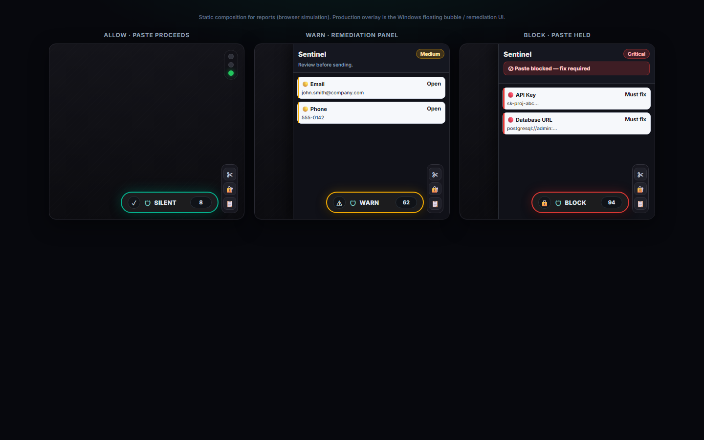
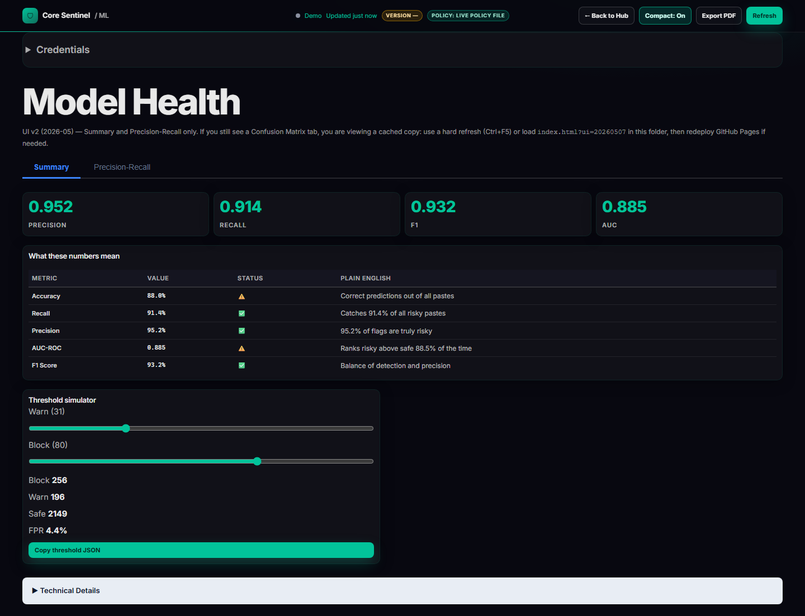

# 6. Results

Use this chapter as the **Results** section for a thesis, capstone report, or professor packet. Replace placeholder figures under [`report-figures/`](report-figures/FIGURES_README.txt) with exported PNGs (or point image paths at existing repo assets listed below).

**Figure numbering (this chapter):** model figures **6.1–6.2**, system UI **6.3–6.8**.

---

## 6.1 Model performance

This subsection quantifies classifier and fused-pipeline behavior on the held-out evaluation setup described in [`ML_SYSTEM_REFERENCE.md`](ML_SYSTEM_REFERENCE.md) and the benchmark driver [`benchmark_phi_pipeline.py`](../core-sentinel-guardrail/benchmark_phi_pipeline.py) (PHI/PII blend profile with five **detection modes** per column: Regex+NER, ML at validation-calibrated τ, ML at test-recommended τ, and the same two thresholds under **Full** = (regex/NER match) OR (ML score ≥ τ)).

### 6.1.1 Multi-configuration benchmark table

The canonical **delta table** reproduced for HIPAA-style blind evaluation (baseline Regex+NER vs ML and Full stacks) lives in **[§12 of `ML_SYSTEM_REFERENCE.md`](ML_SYSTEM_REFERENCE.md#12-benchmark-delta-table-professor-qa-ready)**. Source text: `core-sentinel-guardrail/benchmark_report_hipaa_full.txt` (path as committed or regenerated from `benchmark_phi_pipeline.py`).

| Metric | Regex+NER | ML val-calib | ML test-rec | Full val-calib | Full test-rec |
|--------|-----------|--------------|-------------|----------------|---------------|
| Accuracy | 0.9030 | 0.8832 | 0.8641 | 0.9071 | 0.9068 |
| Precision | 0.9108 | 0.9270 | 0.9437 | 0.9077 | 0.9087 |
| Recall (TPR) | 0.9896 | 0.9452 | 0.9034 | 0.9987 | 0.9971 |
| F1 | 0.9485 | 0.9360 | 0.9231 | 0.9510 | 0.9508 |
| F2 | 0.9727 | 0.9415 | 0.9112 | 0.9791 | 0.9780 |

*Numbers from ML_SYSTEM_REFERENCE §12; refresh after re-running the benchmark on a new artifact.*

For the **full metric block** (FPR, FNR, MCC, counts, AUC, AUPRC) and column legend (what “val-calib” vs “test-rec” means), paste from the benchmark script output or from [`benchmark_threshold_legend_text()`](../core-sentinel-guardrail/benchmark_phi_pipeline.py) commentary.

### 6.1.2 Precision–recall (PR) curve

**Figure 6.1 — Precision–recall curve (high-risk / “risky” class).**


*Placeholder path.* Generate a publication PNG, for example:

```text
python core-sentinel-guardrail/professor_final_benchmark.py
```

…then copy `core-sentinel-guardrail/outputs/precision_recall_curve.png` (or the dashboard-equivalent export) into `docs/report-figures/pr_curve.png`, **or** capture the interactive ML Health **Precision–Recall** tab (Y-axis zoom 0.85–1.0, val-calib / test-rec markers).

### 6.1.3 ROC curve

**Figure 6.2 — Receiver operating characteristic (ROC) curve.**


*Placeholder path.* Typical artifact: `core-sentinel-guardrail/outputs/` ROC PNG from the same professor-benchmark run, copied to `docs/report-figures/roc_curve.png`. Ensure the caption states **which split** (e.g. held-out test) and **which score** (e.g. blended fusion score vs raw `P(risky)`).

---

## 6.2 System screenshots

All paths below are relative to the **`docs/`** folder unless noted.

### 6.2.1 Overlay — three states

**Figure 6.3 — The three overlay states.** Left: allow state (teal pill, paste proceeds silently). Centre: warn state (amber pill, remediation panel shown). Right: block state (red pill, paste held pending user action).



*Asset:* `docs/report-figures/ui-overlay-states.png` — three-panel composition from [`docs/report-figures/overlay-three-states-capture.html`](report-figures/overlay-three-states-capture.html) (browser simulation for the report; regenerate with `python scripts/capture_ml_dashboard_screenshots.py`). For the live Windows app, capture from [`ui_risk_bubble.py`](../core-sentinel-guardrail/ui_risk_bubble.py) if you need pixel-perfect desktop chrome.

### 6.2.2 Layer Inspector

**Figure 6.4 — The Layer Inspector window (Alt+L) showing the pipeline flow diagram, colour-coded span highlights (blue = regex, green = ML, red = critical secret), and per-layer detection metrics.**


*Asset:* `docs/report-figures/ui-layer-inspector.png`. If your build does not yet expose this window, substitute a pipeline diagram from [`THREE_LAYER_PIPELINE.md`](THREE_LAYER_PIPELINE.md) until the screenshot is available.

### 6.2.3 ML Health Dashboard — By Category

**Figure 6.5 — The ML Health Dashboard By Category tab showing per-category F1 scores. Green bars indicate strong performance; red bars indicate categories requiring additional training data.**


*Asset:* `docs/ml/screenshots/04-by-category-tab.png` (add when captured). Per-category F1 is driven by [`model_records`](../data/model_records.json) `metrics.per_category` (see [`docs/ml/index.html`](ml/index.html) category panel). *Implementation note:* some dashboard builds render this block inside the **Summary** tab rather than a separate tab; for your thesis, use the figure caption as written and crop to the category chart/table so the intent is clear.

### 6.2.4 ML Health Dashboard — Summary tab

**Figure 6.6 — The ML Health Dashboard Summary tab showing overall model KPIs and plain-English metric descriptions.**



*Asset:* [`docs/ml/screenshots/01-summary-tab.png`](ml/screenshots/01-summary-tab.png). Regenerate with `python scripts/capture_ml_dashboard_screenshots.py` (from repo root).

### 6.2.5 Landing page

**Figure 6.7 — The Core Sentinel landing page showing the accordion pipeline explanation and live demo iframe.**


*Asset:* `docs/report-figures/ui-landing-page.png` — browser capture of [`index.html`](index.html).

### 6.2.6 Hub dashboard

**Figure 6.8 — The Hub dashboard showing real-time stat cards and recent activity log.**


*Asset:* `docs/report-figures/ui-hub-page.png` — browser capture of [`hub.html`](hub.html).

### 6.2.7 Additional ML Health captures (optional)

| View | Screenshot | Notes |
|------|------------|--------|
| Precision–Recall tab | [`ml/screenshots/02-precision-recall-tab.png`](ml/screenshots/02-precision-recall-tab.png) | Interactive PR curve + policy sidebar |
| Summary + Technical Details | [`ml/screenshots/03-summary-technical-details-open.png`](ml/screenshots/03-summary-technical-details-open.png) | Raw metric table for ML engineers |

---

### Figure checklist (quick)

| Fig | Item | Primary asset |
|-----|------|----------------|
| 6.1 | PR curve | `report-figures/pr_curve.png` or benchmark output |
| 6.2 | ROC curve | `report-figures/roc_curve.png` or benchmark output |
| 6.3 | Overlay (3 states) | `report-figures/ui-overlay-states.png` |
| 6.4 | Layer Inspector (Alt+L) | `report-figures/ui-layer-inspector.png` |
| 6.5 | ML By Category | `ml/screenshots/04-by-category-tab.png` |
| 6.6 | ML Summary | `ml/screenshots/01-summary-tab.png` |
| 6.7 | Landing page | `report-figures/ui-landing-page.png` |
| 6.8 | Hub dashboard | `report-figures/ui-hub-page.png` |
